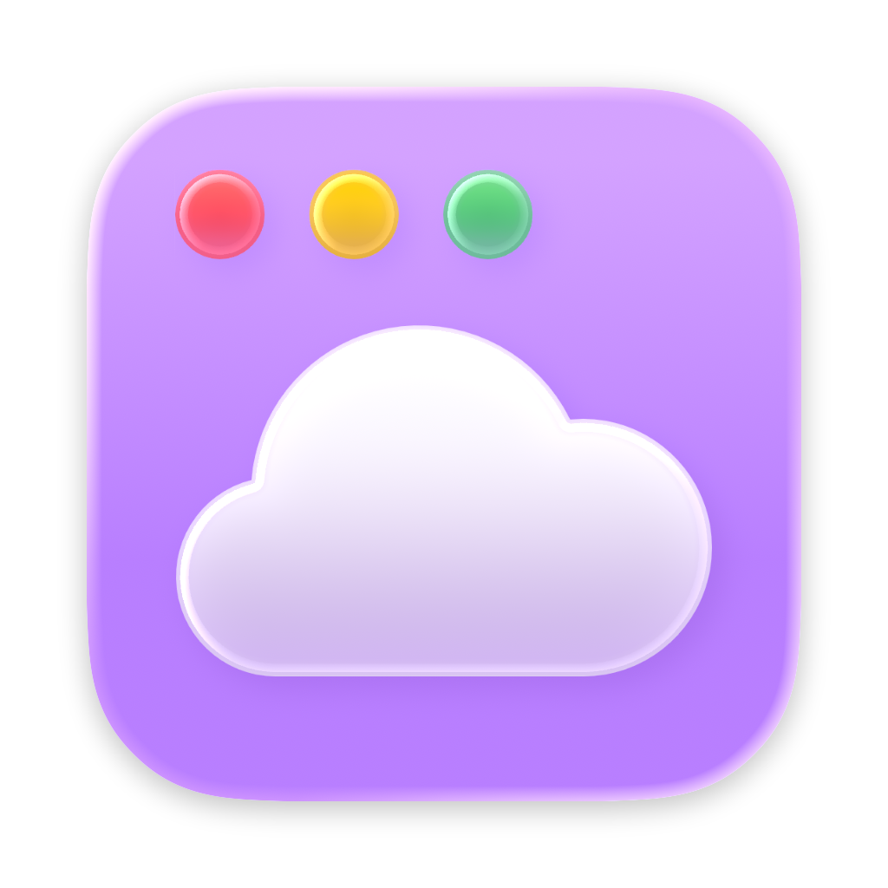
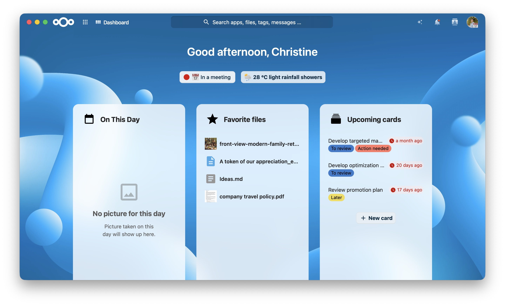
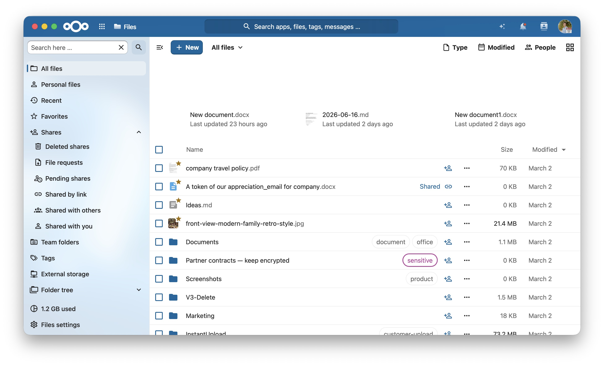
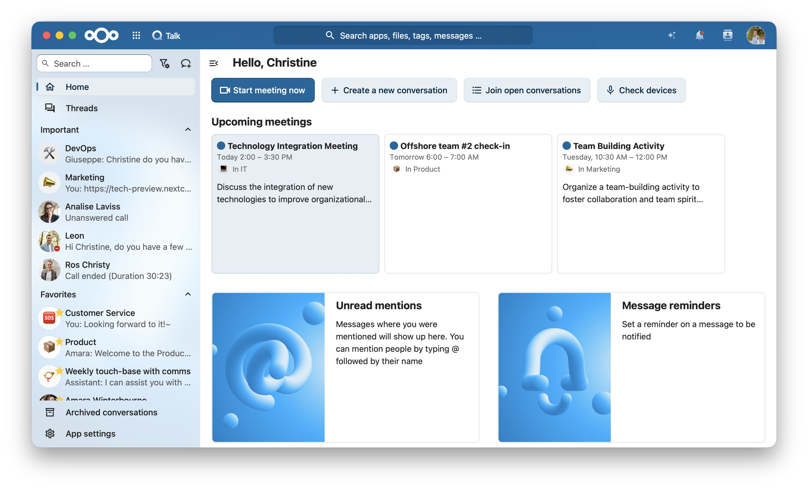
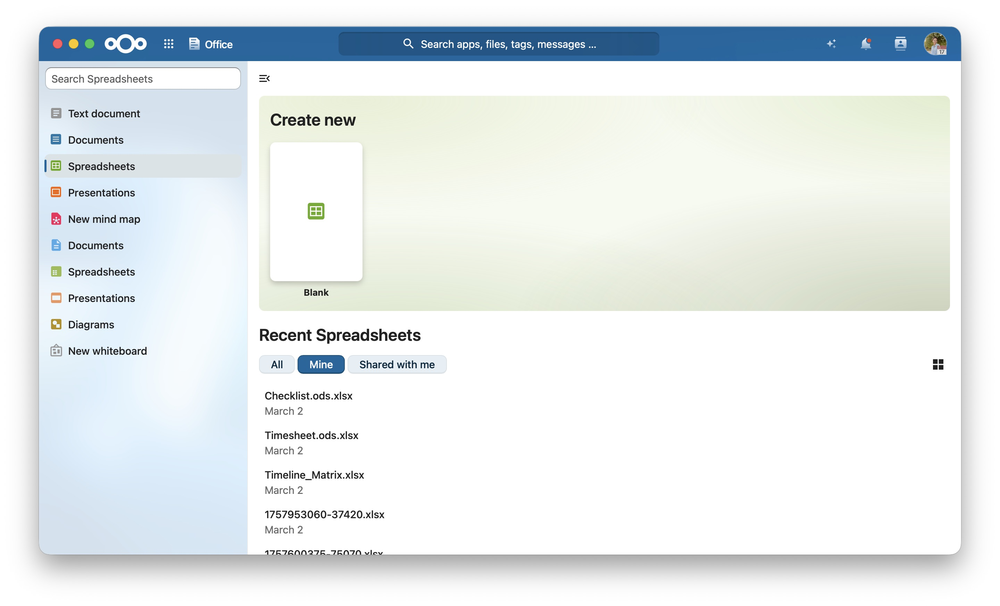
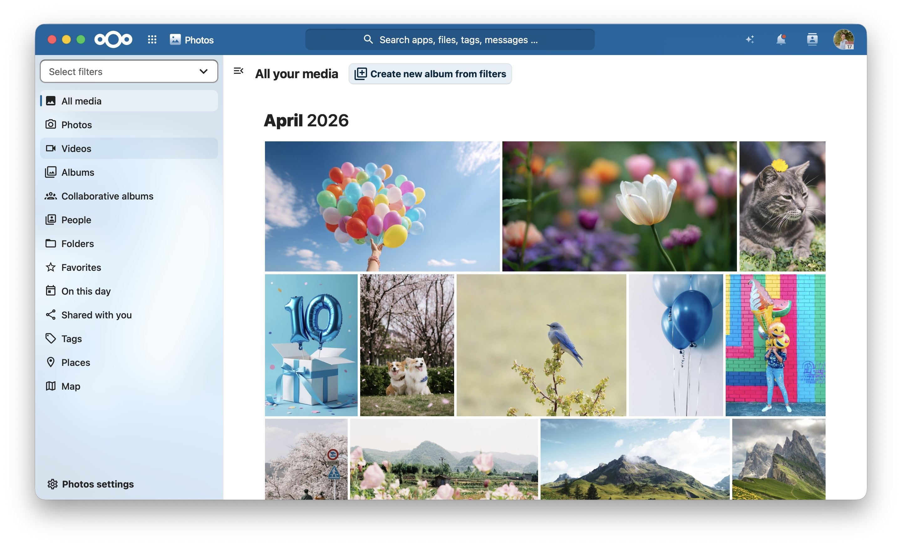
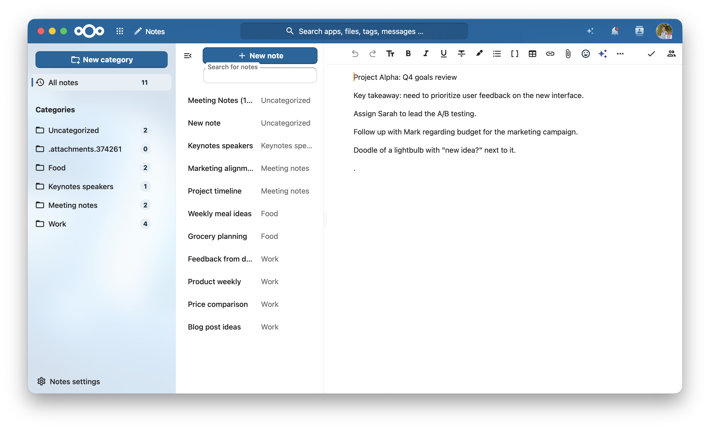

<div align="center">


# Framecloud

An app-like Nextcloud experience on macOS.
This elevates your Nextcloud user interface to the next level by leveraging native platform features and WebKit. 







</div>

## Status

**This is an experiment only, for now.**
But the minimum viable product for an initial release to gather feedback is closing in.
There are a few things still missing before any builds will be made available.

## Features

- Full size content view, no macOS window titlebar or toolbar.
- Windows can be dragged by the Nextcloud top bar.
- Edge to edge content, no unnecessary gaps.
- Sidebar visibility control through app menu item.
- Nextcloud server app speed dials in app menu and dock menu with configurable keyboard shortcuts.
- Window state restoration on relaunch.
- File downloads into the Downloads folder, with a progress window and completion notifications.

## Logging

Framecloud logs through Apple's unified logging system (`os.Logger`). Every type logs under the subsystem `de.i2h3.framecloud` with its own type name as the category, and the asynchronous facilities (asset caching, server validation, sign-in, downloads, launch, and page loads) additionally emit `OSSignposter` intervals.

Capture a live, machine-readable stream while the app runs:

```bash
log stream --debug --predicate 'process == "Framecloud"' --level debug --style ndjson
```

Filter to a single category (type) — for example the download coordinator:

```bash
log stream --predicate 'subsystem == "de.i2h3.framecloud" && category == "DownloadManager"' --level debug
```

To view the signpost intervals as a timeline, record the app in **Instruments** with the *os_signpost* (or *Points of Interest*) instrument.

### Revealing redacted values

Dynamic values such as URLs, file names, and error messages are logged **privately** and appear as `<private>` in captures, which protects user data by default. They are shown automatically when the app runs from Xcode. To reveal them in a `log` capture on a development machine, install a logging **configuration profile** that enables private data for the subsystem.

Save the following as `Framecloud-Logging.mobileconfig`:

```xml
<?xml version="1.0" encoding="UTF-8"?>
<!DOCTYPE plist PUBLIC "-//Apple//DTD PLIST 1.0//EN" "http://www.apple.com/DTDs/PropertyList-1.0.dtd">
<plist version="1.0">
<dict>
    <key>PayloadContent</key>
    <array>
        <dict>
            <key>PayloadType</key>
            <string>com.apple.system.logging</string>
            <key>PayloadIdentifier</key>
            <string>de.i2h3.framecloud.logging</string>
            <key>PayloadUUID</key>
            <string>4F3F20ED-E83B-491A-BB4C-3C6ED60C0F3B</string>
            <key>PayloadVersion</key>
            <integer>1</integer>
            <key>PayloadDisplayName</key>
            <string>Framecloud Logging</string>
            <key>Subsystems</key>
            <dict>
                <key>de.i2h3.framecloud</key>
                <dict>
                    <key>Enable-Private-Data</key>
                    <true/>
                </dict>
            </dict>
        </dict>
    </array>
    <key>PayloadDisplayName</key>
    <string>Framecloud Logging</string>
    <key>PayloadIdentifier</key>
    <string>de.i2h3.framecloud.logging.profile</string>
    <key>PayloadType</key>
    <string>Configuration</string>
    <key>PayloadUUID</key>
    <string>E8D6331A-C9D3-4324-A263-067ABA5DA123</string>
    <key>PayloadVersion</key>
    <integer>1</integer>
    <key>PayloadScope</key>
    <string>System</string>
</dict>
</plist>
```

Double-click the file, then approve it under **System Settings ▸ General ▸ Device Management**. With the profile installed, the same `log stream` command shows the previously `<private>` values in the clear. **Remove the profile when you are done** (same pane ▸ select *Framecloud Logging* ▸ Remove) so private data is no longer written to the log unprotected.

## Disclaimer

This is an unofficial third-party app out of the Nextcloud community.
It is not associated with or endorsed by Nextcloud GmbH.

## Privacy Policy

The Framecloud app does not collect any data.

## License

See [LICENSE](./LICENSE).
