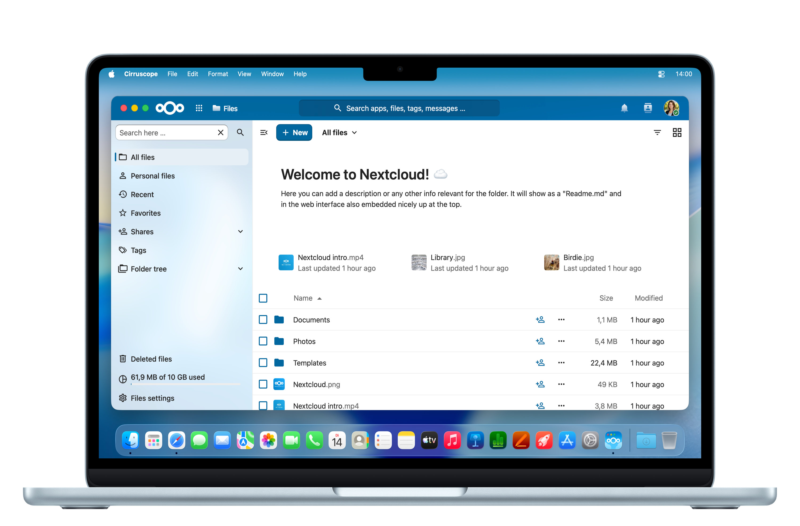

<!--
SPDX-FileCopyrightText: 2026 Iva Horn
SPDX-License-Identifier: MIT
-->

    

# Cirruscope

**This page is for developers. For a more general introduction, see [the official website](https://cirruscope.app).**

## Project Status

The app is in the App Store review process.

## Contributing

See [CONTRIBUTING.md](./CONTRIBUTING.md).

## License

See [LICENSE](./LICENSE).

## Disclaimer

This is an unofficial third-party app.
It is not associated with or endorsed by Nextcloud GmbH.
