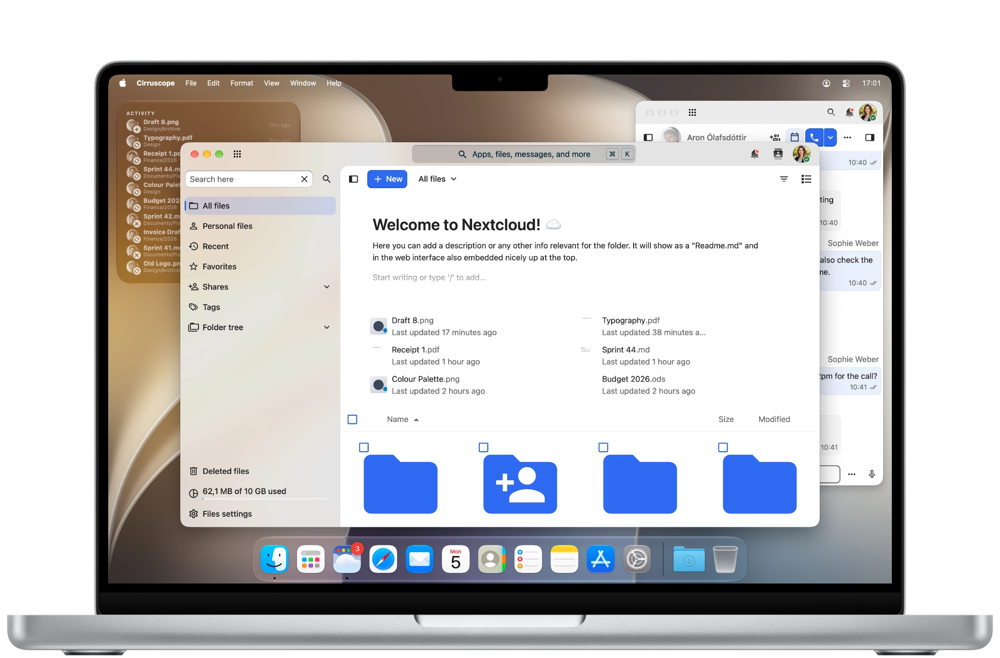

<!--
SPDX-FileCopyrightText: 2026 Iva Horn
SPDX-License-Identifier: MIT
-->

    

# Cirruscope

**This page is for developers.
For a more general introduction, see [the official website](https://cirruscope.app).**

## Contributing

Contributions are welcome.
See [CONTRIBUTING.md](./CONTRIBUTING.md) for the workflow.

## License

See [LICENSE](./LICENSE).

## Disclaimer

Cirruscope is an independent project from the Nextcloud community. It is not affiliated with Nextcloud GmbH.
